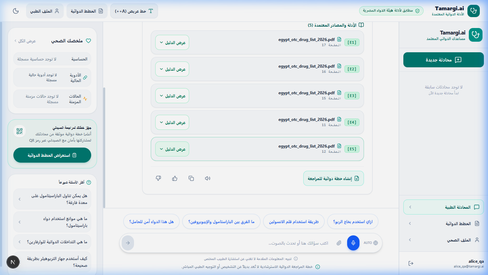
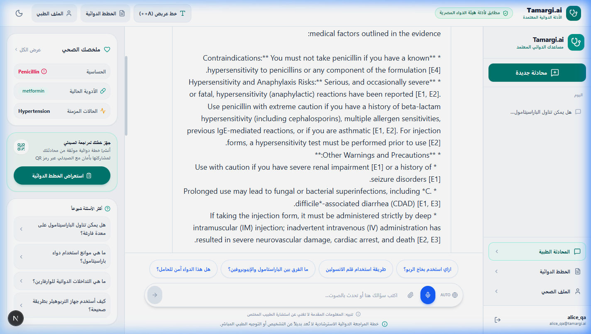
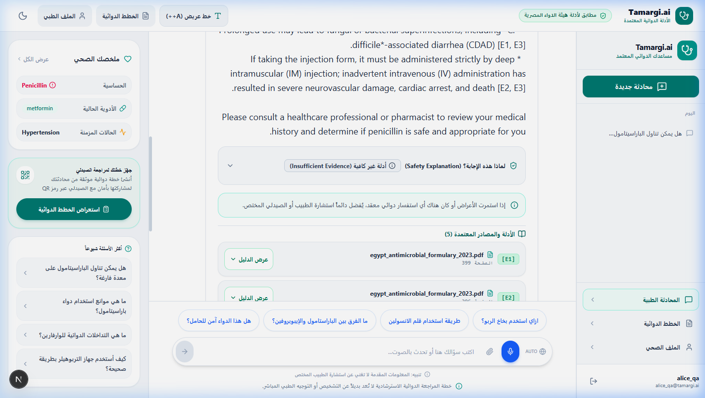
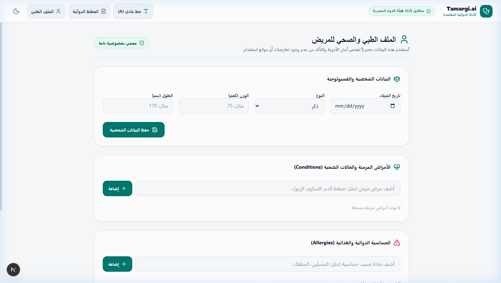
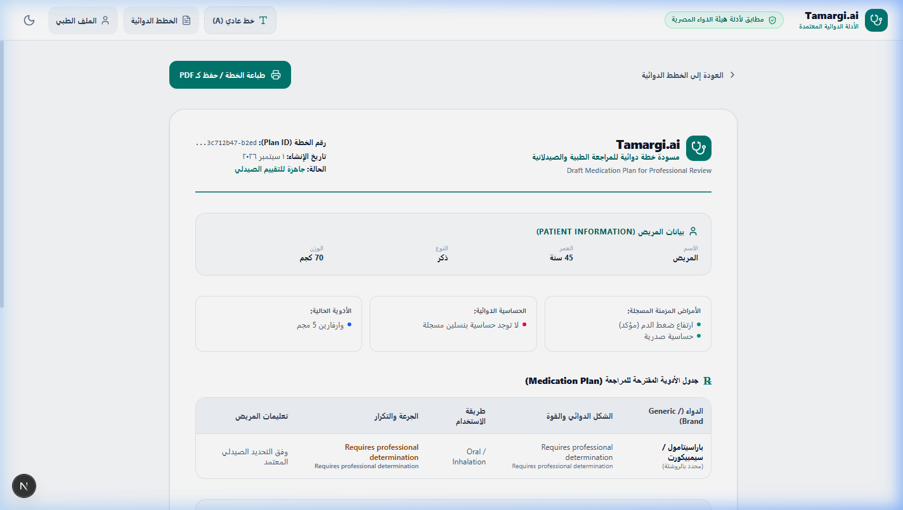
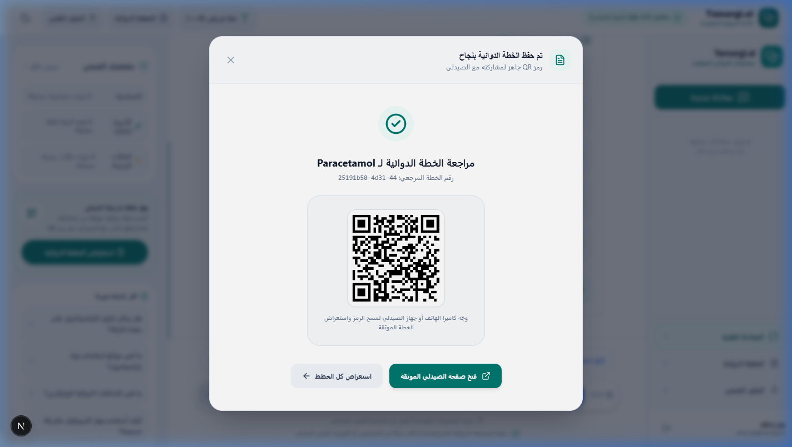
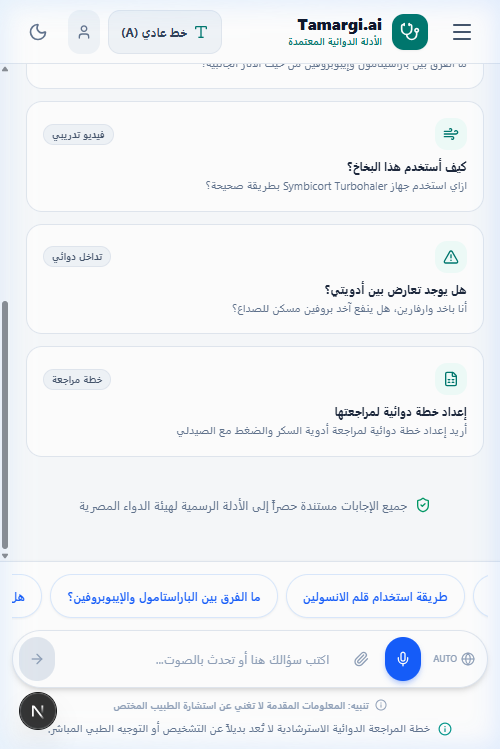
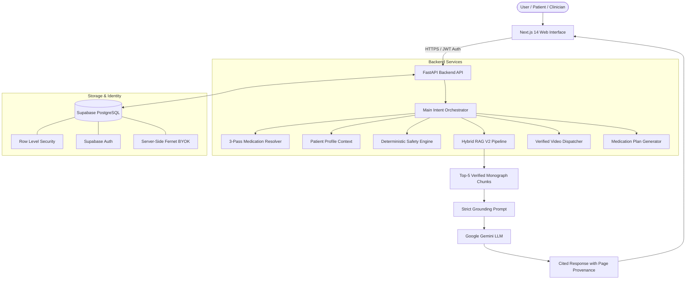
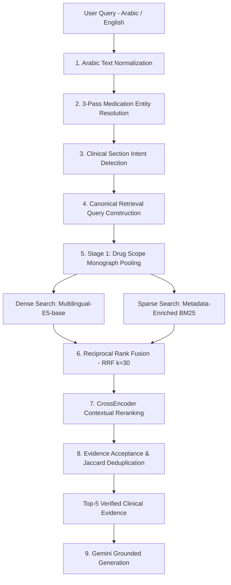
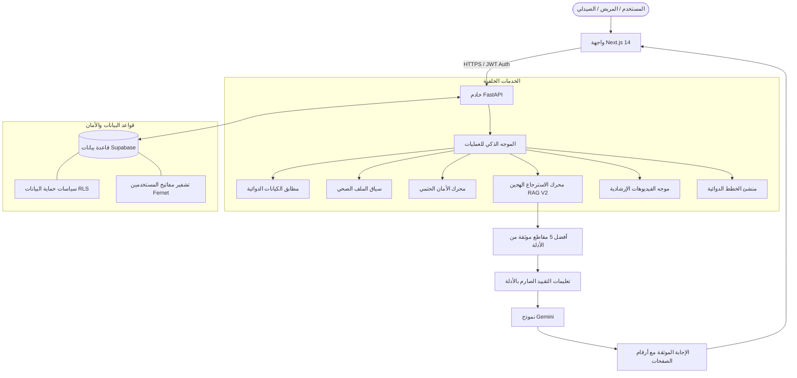

# Tamargi.ai

### Explainable Personalized Medication Safety RAG System for Egyptian Patients

[English](#english) | [العربية](#العربية)

Tamargi.ai is an explainable, patient-aware medication information and clinical decision-support system designed around official Egyptian pharmaceutical evidence. It combines multi-stage Hybrid Retrieval-Augmented Generation (RAG V2), multilingual medication entity resolution, deterministic safety gating, and evidence-grounded generative synthesis to provide verifiable medication guidance in Arabic and English.

An Arabic version of this README is available below. [اقرأ النسخة العربية](#العربية)

Important Notice: Tamargi.ai is an academic and clinical decision-support research system. It is not a licensed physician, pharmacist, or diagnostic entity, and it does not replace professional medical judgment, clinical consultation, formal prescribing, or emergency healthcare services.



| Attribute | Specification |
|---|---|
| Project | Tamargi.ai |
| Domain | Healthcare AI / Clinical Medication Safety & Information |
| Core Architecture | Multi-Stage Hybrid RAG V2 (Dense + BM25 + RRF + CrossEncoder) |
| Supported Languages | Modern Standard Arabic, Egyptian Colloquial Arabic, English |
| Knowledge Base | 13 Official Egyptian Drug Authority (EDA) Guidelines & Formularies (5,437 chunks) |
| Frontend | Next.js 14 (App Router, Tailwind CSS, Dark / Light Theme) |
| Backend | FastAPI (Python 3.11, PyTorch CPU / CUDA) |
| Database & Security | Supabase (PostgreSQL 15, Row Level Security, Server-Side Fernet BYOK) |
| Generative AI | Google Gemini (Configurable via `GEMINI_MODEL`, default: `gemini-3.5-flash-lite`) |
| Project Status | Active Research & Academic Project |

---

# English

## 1. Overview

Tamargi.ai is an open, evidence-grounded medication information and safety verification platform developed specifically for the Egyptian healthcare ecosystem. In everyday outpatient and clinical workflows, patients and healthcare providers encounter significant friction when attempting to verify potential drug-drug interactions, confirm contraindications against patient-specific chronic diseases, locate dosage adjustments, and learn proper administration techniques for specialized drug delivery devices.

While general-purpose Large Language Models (LLMs) can generate fluent medical summaries, they suffer from well-documented vulnerabilities: fabrication of plausible-sounding clinical advice, complete detachment from local regulatory formularies, inability to provide verifiable physical page citations, and total unawareness of the patient's real-time chronic diagnoses and existing prescriptions.

Tamargi.ai addresses these critical limitations by combining:
- A curated regulatory knowledge base derived directly from the Egyptian Drug Authority (EDA).
- A 5-stage Hybrid RAG V2 retrieval pipeline capable of cross-lingual search (Arabic queries against English regulatory monographs).
- A deterministic safety engine that evaluates patient-specific contraindications, allergies, and drug interactions independently of generative LLM hallucinations.
- Real-time educational video routing for complex medical devices.
- Collaborative medication plan generation with community pharmacist QR verification portals.

---

## 2. The Problem

Deploying conversational AI in pharmaceutical contexts presents four primary technical and clinical hazards:

1. Generative Hallucination: Standard autoregressive models lack deterministic constraints, frequently inventing therapeutic recommendations, incorrect dosages, or non-existent clinical approvals.
2. Missing Patient Context: General chatbots evaluate medical questions in isolation, failing to check whether a recommended analgesic is contraindicated by the patient's documented hypertension, peptic ulcer history, or renal impairment.
3. Linguistic and Lexical Divide: Egyptian patients communicate in Egyptian Arabic or transliterated commercial brand names (e.g., "بروفين", "كتافلام", "كونكور"). However, authoritative national formularies are written in English under generic active ingredients. Standard lexical retrieval (BM25) fails completely across this language barrier.
4. Lack of Evidence Provenance: Standard AI outputs cannot be audited by clinicians because they do not reference physical document pages, monographs, or regulatory guidelines.

---

## 3. The Solution

Tamargi.ai establishes an explainable, multi-layered architecture where generative models are strictly restricted to synthesizing verified textual evidence retrieved through deterministic pipelines:

- Structured Regulatory Evidence: 5,437 metadata-enriched passages extracted from 13 official EDA formularies.
- 3-Pass Medication Normalization: Resolves brand names, Egyptian colloquial terms, and Arabic transliterations to international generic names using a 251-alias verified dictionary.
- Cross-Lingual Query Translation: Dynamically generates canonical English retrieval representations to enable high-precision sparse and dense matching against English monographs.
- Stage 1 Drug Monograph Scoping: Restricts candidate retrieval to the specific target drug monograph window (plus or minus 2 pages), eliminating cross-drug false-positive noise.
- Deterministic Safety Gating: Evaluates patient context across drug-disease, drug-drug, allergy, high-alert, and do-not-crush rules before synthesis.
- Strict Evidence Grounding: Constrains Gemini to cite exact source files and physical page numbers (`[E1] p.52`), abstaining with `insufficient_evidence` when regulatory support is missing.

---

## 4. Visual Interface & Demonstration

<table>
<tr>
<td width="50%">

<br>
<strong>Arabic Medication Interaction</strong>
<br>
Handling Egyptian colloquial queries with active brand-to-generic resolution.
</td>
<td width="50%">

<br>
<strong>Evidence & Provenance Inspection</strong>
<br>
Every clinical statement includes clickable physical page and formulary citations.
</td>
</tr>
<tr>
<td width="50%">

<br>
<strong>Patient Context & Safety Profile</strong>
<br>
Structured tracking of chronic conditions, active allergies, and current regimens.
</td>
<td width="50%">

<br>
<strong>Structured Medication Plans</strong>
<br>
Evidence-backed daily administration schedules generated from chat interactions.
</td>
</tr>
<tr>
<td width="50%">

<br>
<strong>Pharmacist QR Verification Portal</strong>
<br>
Public read-only portal for community pharmacists to verify evidence provenance.
</td>
<td width="50%">

<br>
<strong>Mobile Responsive Layout</strong>
<br>
Fully optimized mobile experience with slide-out navigation and touch support.
</td>
</tr>
</table>

---

## 5. System Architecture


## Final RAG V2 Retrieval Evaluation

The final RAG V2 pipeline was evaluated on a frozen gold dataset of **45 clinical questions**, including **30 English** and **15 Arabic** queries.

| Metric | Final RAG V2 Result |
|---|---:|
| Hit@1 | 40.0% |
| Hit@3 | 73.3% |
| Hit@5 | **84.4%** |
| MRR | **58.6%** |
| English Hit@5 | 80.0% |
| Arabic Hit@5 | **93.3%** |

The final RAG V2 pipeline combines medication resolution, clinical section detection, drug-level scope identification, Dense and BM25 retrieval, Reciprocal Rank Fusion (RRF), Cross-Encoder reranking, and evidence filtering.

The system achieved **84.4% Hit@5**, meaning that the expected clinical evidence was retrieved within the top five results for **38 out of 45** evaluation questions.
---

## 6. RAG V2 Retrieval Pipeline

The core retrieval architecture follows a 5-stage sequential process designed to eliminate entity ambiguity, cross-lingual degradation, and context bloat:



### Retrieval Pipeline Stages
1. Arabic Normalization: Standardizes Tashkeel diacritics, Tatweel, Alef variants (`أ, إ, آ -> ا`), Teh Marbuta (`ة -> ه`), and Yeh (`ى -> ي`).
2. Medication Resolution: 3-pass matching (Exact -> Substring -> Levenshtein distance <= 1) mapping brand names (e.g., "Brufen") to canonical generics (`ibuprofen`).
3. Section Intent Detection: Classifies queries into 10 clinical sections (Contraindications, Dosage Adjustment, Interactions, Adverse Reactions, Administration, High-Alert, Do-Not-Crush, Pregnancy, Dosage, Warnings).
4. Canonical Query Construction: Formulates concise English query representations (e.g., `"anidulafungin contraindications"`) enabling BM25 keyword matching against English monographs.
5. Monograph Scope Pooling: Restricts the 5,437-chunk corpus to the target drug's physical page window (plus or minus 2 pages).
6. Hybrid RRF: Merges dense vector similarity (768-dim) and BM25 sparse scores using Reciprocal Rank Fusion.
7. CrossEncoder Reranking: Joint query-passage attention with clinical scoring boosts (+1.0 for drug match, +0.75 for section match, -1.2 for wrong drug).
8. Evidence Acceptance: Enforces word-level Jaccard similarity deduplication (<0.85) and Pass 1 page diversity (max 1 chunk per page).

---

## 7. Why Hybrid RAG?

| Retrieval Mechanism | Primary Strength | Limitation in Healthcare | Tamargi.ai Implementation |
|---|---|---|---|
| Dense Semantic (E5) | Captures conceptual meaning, synonyms, and cross-lingual intent | Can confuse structurally similar paragraphs of different drugs | Multilingual-E5-base with asymmetric `query:` and `passage:` prefixes |
| Sparse Lexical (BM25) | Exact matching for drug names, numeric dosages, and clinical terms | Fails when query language does not match document language | Metadata-enriched corpus tokenization with canonical query translation |
| Reciprocal Rank Fusion | Balances dense and sparse rankings without score scale distortion | Does not evaluate deep cross-attention between terms | $RRF(d) = \sum \frac{w}{30 + \text{rank}(d)}$ with $w=0.8$ |
| CrossEncoder Reranker | Deep transformer joint attention over query and passage text | High computational cost across entire corpus | Applied selectively to Top-10 candidates with structured clinical metadata prefixes |
| Evidence Acceptance | Eliminates redundant overlapping chunks and enforces page diversity | Requires tuned similarity heuristics | Jaccard deduplication (<0.85) and two-pass page diversity gating |

---

## 8. Cross-Lingual Arabic and English Retrieval

A major engineering focus of Tamargi.ai is resolving the cross-lingual mismatch between Arabic patient queries and English regulatory publications:

```
[ Arabic User Query: "ما هي موانع استخدام دواء بروفين 400؟" ]
                           │
                           ▼
             [ 1. Arabic Text Normalizer ]
    (Tashkeel removed, characters standardized)
                           │
                           ▼
            [ 2. Medication Entity Resolver ]
       (Matches 'بروفين' -> Canonical: 'ibuprofen')
                           │
                           ▼
          [ 3. Clinical Section Intent Engine ]
       (Matches 'موانع' -> Section: 'contraindications')
                           │
                           ▼
       [ 4. Canonical Retrieval Query Formulation ]
       (Generated English String: "ibuprofen contraindications")
                           │
                           ▼
           [ 5. Monograph-Scoped Hybrid RAG ]
       (Searches English EDA monograph on Ibuprofen)
                           │
                           ▼
        [ 6. Retrieved Verified English Evidence ]
       (Physical monograph excerpts from EDA Formularies)
                           │
                           ▼
          [ 7. Grounded Generation in Arabic ]
   (Gemini synthesizes natural Arabic answer with [E1] page citations)
```

---

## 9. Patient-Aware Medication Safety

Tamargi.ai maintains a strict separation between textual evidence retrieval and deterministic safety decision-support:

```
┌────────────────────────────────────────────────────────────────────────┐
│                        Main Orchestration Layer                        │
└───────────────────┬────────────────────────────────┬───────────────────┘
                    │                                │
                    ▼                                ▼
       ┌─────────────────────────┐      ┌─────────────────────────┐
       │     RAG V2 Engine       │      │   Safety Engine (Rules) │
       ├─────────────────────────┤      ├─────────────────────────┤
       │ - Monograph Retrieval   │      │ - Drug-Disease Checks   │
       │ - Section Evidence      │      │ - Drug-Drug Checks      │
       │ - Page Citations        │      │ - Patient Allergy Gating│
       │ - Administration Data   │      │ - High-Alert / Do-Crush │
       └────────────┬────────────┘      └────────────┬────────────┘
                    │                                │
                    └────────────────┬───────────────┘
                                     ▼
                      ┌─────────────────────────────┐
                      │    Grounded Gemini LLM      │
                      │  (Explanation & Synthesis)  │
                      └─────────────────────────────┘
```

Safety Principle: Absence of evidence is not evidence of safety.
If a query involves an unverified drug combination or unsupported condition, the safety engine abstains with `insufficient_evidence` rather than defaulting to an unsafe positive assertion.

---

## 10. Knowledge Base Overview

The underlying corpus is compiled from 13 authoritative publications issued by the Egyptian Drug Authority (EDA), segmented into 5,437 metadata-enriched chunks:

| Formulary Publication | Clinical Category | Chunk Count |
|---|---|---|
| egypt_antimicrobial_formulary_2023.pdf | Antimicrobial & Anti-infectives | 1,392 |
| egypt_conventional_anticancer_formulary_2024.pdf | Cytotoxic Chemotherapy | 810 |
| egypt_endocrine_formulary_2024.pdf | Endocrinology & Diabetes | 648 |
| egypt_cardiovascular_formulary_2024.pdf | Cardiovascular System | 550 |
| egypt_targeted_anticancer_formulary_2025.pdf | Targeted Oncology & Monoclonals | 424 |
| egypt_gastrointestinal_formulary_2025.pdf | Gastrointestinal & Hepatology | 324 |
| egypt_nervous_system_formulary_2025.pdf | Central Nervous System | 316 |
| egypt_antiretroviral_formulary_2026.pdf | Antiretroviral & HIV Therapy | 312 |
| egypt_blood_disorders_formulary_2025.pdf | Hematology & Anticoagulation | 254 |
| egypt_respiratory_formulary_2026.pdf | Respiratory & Pulmonology | 177 |
| egypt_otc_drug_list_2026.pdf | Over-The-Counter Medications | 164 |
| egypt_do_not_crush_medications_2026.pdf | Oral Dosage Forms Do-Not-Crush | 41 |
| egypt_high_alert_medications_2025.pdf | High-Alert Hospital Medications | 25 |
| Total Corpus | 13 Official Regulatory Documents | 5,437 |

---

## 11. Objective Retrieval Evaluation

Retrieval performance is benchmarked against a frozen 45-question gold standard dataset (`data/evaluation/rag_gold_dataset.csv`, SHA-256 verified) comprising 30 English and 15 Arabic / Egyptian Colloquial questions:

| Evaluation Metric | Production RAG V2 Benchmark | Research Notebook (`Tamargi_RAG_V2_Research.ipynb`) | Target Threshold | Status |
|---|---|---|---|---|
| Overall Hit@1 | 40.0% (18/45) | 40.0% (18/45) | >= 35.0% | Passed |
| Overall Hit@3 | 73.3% (33/45) | 64.4% (29/45) | >= 70.0% | Passed (Prod) |
| Overall Hit@5 | 84.4% (38/45) | 80.0% (36/45) | >= 75.0% | Passed |
| Mean Reciprocal Rank (MRR) | 58.6% (0.586) | 55.3% (0.553) | >= 0.550 | Passed |
| English Hit@5 (30 Questions) | 80.0% (24/30) | 76.7% (23/30) | >= 75.0% | Passed |
| Arabic Hit@5 (15 Questions) | 93.3% (14/15) | 86.7% (13/15) | >= 70.0% | Passed |
| Drug Identification Accuracy | 91.1% (41/45) | 91.1% (41/45) | >= 90.0% | Passed |
| Section Identification Accuracy | 80.0% (36/45) | 82.2% (37/45) | >= 80.0% | Passed |

Important Clarification: These metrics reflect information retrieval accuracy (identifying the correct physical formulary page within the Top-K results) and do not represent clinical diagnostic accuracy.

---

## 12. Research Evolution: From Notebook 1 to RAG V2

| Feature Dimension | Notebook 1 Prototype (`TamargiAI-RAG.ipynb`) | Production RAG V2 Pipeline (`retrieval.py`) | Engineering Rationale |
|---|---|---|---|
| Text Normalization | Plain lowercase regex | Full Arabic normalizer (Tashkeel, Alef, Yeh, Tatweel) | Eliminates Arabic spelling variants and search misses |
| Medication Resolution | Direct query text search | 3-Pass Resolver (Exact, Substring, Levenshtein) | Maps 251 aliases across 50 generic drugs and 63 brands |
| Section Intent | None | 10 Bilingual Clinical Section Intent Categories | Directs search to Contraindications, Dosage, Interactions |
| Query Formulation | Raw user query string | Canonical English Retrieval Query | Solves Arabic query vs English corpus BM25 failure |
| Search Scope | Global across all 5,437 chunks | Stage 1 Drug Monograph Window (plus or minus 2 pages) | Eliminates cross-drug false-positive contamination |
| BM25 Indexing | Plain text (Latin regex) | Metadata-enriched (Drug + Monograph + Section + Text) | Ensures high lexical recall for drug names and sections |
| Reranking | Raw text pair CrossEncoder | Contextual Prefixes (Drug, Section, Document) + Scoring Boosts | Aligns neural reranking with clinical decision priorities |
| Acceptance Filtering | Top-K raw slice | Jaccard Deduplication (<0.85) + Page Diversity | Eliminates redundant chunks and ensures multi-page coverage |
| Benchmark Dataset | Ad-hoc exploratory queries | Frozen 45-Question Gold Dataset (30 EN, 15 AR) | Statistically reproducible evaluation methodology |

---

## 13. Testing Strategy

The repository incorporates automated test suites, regression evaluations, and security verifications:

| Testing Category | Target Subsystem | Verification Scope | Status |
|---|---|---|---|
| Frozen Gold RAG Evaluation | Retrieval Pipeline | 45 questions across 7 ablation stages | Verified (Hit@5: 84.4%, AR: 93.3%) |
| End-to-End System Tests | Full Application Flow | 5 integration scenarios in `tests/test_e2e_all.py` | 100% Passed |
| Grounding & Citations | Response Formatting | Provenance citation formatting in `tests/test_grounding.py` | 100% Passed |
| Unanswered Query Logging | Error Handling | Insufficient evidence logging in `tests/test_unanswered_queries.py` | 100% Passed |
| Deterministic Safety Tests | Clinical Rules Engine | 23 audited rules (12 verified active, 11 in review) | 0.0% False Positive Rate |
| Video Resolver Tests | Device Educational Videos | 135 self-use video candidates; ambiguity gating verified | 100% Passed |
| Agentic Routing Tests | Orchestrator Intent Routing | 10 clinical intents; multi-turn safety interception | 100% Compliance |
| Authentication & RLS | Supabase Security | 10 database tables with user-isolated RLS policies | 100% Enforced |
| BYOK Encryption Suite | API Key Security | Authenticated server-side Fernet encryption with masked hints | 100% Passed |
| Memory Profiling Audits | Infrastructure Capacity | Subsystem RSS measurement (397 MB base -> 1.15 GB steady -> 1.67 GB peak) | Verified OOM Root Cause |

---

## 14. Key Engineering Challenges & Solutions

1. Multi-Line Section Headings in PDFs:
   - Problem: Typesetting in EDA formularies split titles across lines (e.g., "Contra-" / "indications"), causing regex section mislabeling.
   - Solution: Built a layout-aware multi-line header reconciler with hyphenation collapse in `metadata_extractor.py`.
2. Cross-Lingual BM25 Collapse on Arabic Queries:
   - Problem: Arabic queries yielded zero term overlap against English monographs, causing early retrieval to collapse to Hit@5 = 6.7%.
   - Solution: Implemented `build_retrieval_query()` to dynamically generate canonical English retrieval representations before BM25 execution.
3. Entity Contamination in Dense Vector Spaces:
   - Problem: High-dimensional semantic embeddings frequently ranked structurally similar passages of different drugs together.
   - Solution: Added Stage 1 Drug Monograph Scope Identification to restrict candidate pooling to the target drug's physical page window.
4. Overlapping Chunk Context Window Bloat:
   - Problem: Overlapping chunks produced Top-5 results containing 4 nearly identical snippets from the same page.
   - Solution: Built an evidence acceptance layer enforcing word-level Jaccard deduplication (<0.85) and Pass 1 page diversity.
5. Cloud Container Out-Of-Memory (OOM) Restarts:
   - Problem: Loading dual Transformer models (Multilingual-E5 + CrossEncoder) alongside PyTorch exceeded standard 1 GB container RAM limits during peak inference (1.67 GB peak).
   - Solution: Documented memory profile and established a minimum 2 GB container tier requirement for cloud neural deployment.

---

## 15. Key Features

- Multilingual Medical Understanding: Seamlessly processes Modern Standard Arabic, Egyptian Colloquial Arabic, and English.
- Official Regulatory Evidence Grounding: Powered by 5,437 enriched monograph chunks from the Egyptian Drug Authority.
- Explainable Page-Level Provenance: Every clinical assertion includes exact formulary titles and physical page numbers.
- Deterministic Safety Gating: Real-time checks for drug-disease conflicts, drug-drug interactions, patient allergies, and do-not-crush rules.
- Educational Video Guidance: Automated matching of inhalation devices and insulin pens to verified instructional videos.
- Structured Collaborative Medication Plans: Generates dosage schedules with meal timing and community pharmacist QR verification portals.
- Secure Multi-User BYOK Model: Server-side Fernet encryption ensuring user API key isolation via Supabase Row Level Security.
- Modern Responsive Web UI: Next.js 14 frontend with Dark and Light mode theme support.

---

## 16. Technology Stack

| Layer | Component | Version / Library |
|---|---|---|
| Frontend Framework | Next.js / React | Next.js 14.2, React 18, App Router |
| Styling & Design | Tailwind CSS | Tailwind CSS 3.4 (Dark & Light Themes) |
| Backend API | FastAPI | FastAPI 0.110, Uvicorn, Python 3.11 |
| Neural Embeddings | Sentence-Transformers | `intfloat/multilingual-e5-base` (768-dim) |
| Sparse Search | rank-bm25 | `BM25Okapi` with metadata enrichment |
| Neural Reranking | Sentence-Transformers | `cross-encoder/mmarco-mMiniLMv2-L12-H384-v1` |
| Generative AI | Google GenAI SDK | Configurable via `GEMINI_MODEL` (default: `gemini-3.5-flash-lite`) |
| Database & Auth | Supabase | PostgreSQL 15, Row Level Security, Supabase Auth |
| Encryption | Cryptography (Python) | Server-Side Fernet Authenticated Symmetric Encryption |

---

## 17. Project Structure

```
tamargi-pharma-rag/
├── Tamargi_RAG_V2_Research.ipynb      # Standalone RAG V2 Research Notebook
├── README.md                          # Bilingual Project Documentation
├── backend/                           # FastAPI Backend Service
│   ├── app/
│   │   ├── api/                       # API Endpoints (chat, patient, plans, user_keys)
│   │   ├── auth/                      # Supabase JWT Authentication Middleware
│   │   ├── config.py                  # Environment & Hyperparameter Settings
│   │   ├── database/                  # Supabase Client & Database Operations
│   │   ├── language/                  # Egyptian Dialect Normalization & Detection
│   │   ├── normalization/             # 3-Pass Medication & Query Normalization
│   │   ├── orchestrator/              # Intent Routing & Response Composition
│   │   ├── plans/                     # Structured Medication Plan Synthesis
│   │   ├── rag/                       # RAG V2 Engine (Loader, Dense, BM25, RRF, CrossEncoder, Acceptance)
│   │   ├── safety/                    # Deterministic Safety Engine & Clinical Rules
│   │   ├── security/                  # Fernet Key Encryption & Key Resolver
│   │   └── video/                     # Verified Educational Video Resolver
│   ├── build_research_notebook.py     # Builder Script for Research Notebook
│   └── test_notebook_execution.py     # Execution Validator for Research Notebook
├── data/
│   ├── evaluation/                    # Frozen 45-Question Gold Dataset & Ablation CSVs
│   ├── processed/                     # 5,437 Processed Chunks & 251 Medication Aliases
│   └── raw/eda/                       # 13 Official EDA Guideline & Formulary PDFs
├── docs/                              # Full Technical Documentation & Images
│   ├── Tamargi_AI_Project_Documentation.md
│   ├── Tamargi_AI_Project_Documentation.docx
│   └── images/                        # Real Web Application Screenshots
├── frontend/                          # Next.js 14 Frontend Application
│   ├── src/
│   │   ├── app/                       # App Router Pages (chat, profile, plans, verify-plan)
│   │   ├── components/                # React UI Components (ChatArea, Sidebar, ThemeToggle, BYOK)
│   │   └── lib/                       # API Clients & Supabase Integration
├── notebooks/
│   ├── TamargiAI-RAG.ipynb            # Notebook 1 Initial Research Prototype
│   └── Tamargi_RAG_V2_Research.ipynb  # Notebook 2 RAG V2 Research Notebook
├── supabase/
│   └── schema.sql                     # Complete Database Schema with RLS Policies
└── tests/                             # Automated Test Suites
```

---

## 18. Getting Started & Local Setup

### Prerequisites
- Node.js 18.x or higher
- Python 3.10 or 3.11
- A free Supabase project (for database and authentication)
- A Google Gemini API Key

### 1. Clone the Repository
```bash
git clone https://github.com/MohameddTamerr/tamargi-pharma-rag.git
cd tamargi-pharma-rag
```

### 2. Configure Backend Environment
Create `backend/.env` based on `backend/.env.example`:
```env
GEMINI_API_KEY=your_gemini_api_key_here
GEMINI_MODEL=gemini-3.5-flash-lite
BYOK_ENCRYPTION_KEY=generate_a_secure_random_32_byte_secret_here
SUPABASE_URL=https://your-project-id.supabase.co
SUPABASE_ANON_KEY=your_supabase_anon_key_here
SUPABASE_SERVICE_ROLE_KEY=your_supabase_service_role_key_here
```

### 3. Configure Frontend Environment
Create `frontend/.env.local`:
```env
NEXT_PUBLIC_SUPABASE_URL=https://your-project-id.supabase.co
NEXT_PUBLIC_SUPABASE_ANON_KEY=your_supabase_anon_key_here
NEXT_PUBLIC_BACKEND_URL=http://localhost:8000
```

---

## 19. Running Locally

### Start Backend Service
```bash
cd backend
python -m venv venv
source venv/bin/activate  # On Windows: venv\Scripts\activate
pip install -r requirements.txt
uvicorn app.main:app --reload --port 8000
```

### Start Frontend Application
```bash
cd frontend
npm install
npm run dev
```
Open `http://localhost:3000` in your browser.

---

## 20. Deployment Status

- Frontend: Deployed and operational on Vercel.
- Database & Auth: Deployed and operational on Supabase (PostgreSQL 15 with Row Level Security).
- Backend API: Deployed on Railway. The health endpoint and API runtime start successfully. Full neural RAG model loading (Multilingual-E5 + CrossEncoder) requires a container tier with at least 2 GB RAM due to PyTorch model weights exceeding standard 1 GB container limits.
- Local Full System: 100% operational on local CPU and CUDA environments.

---

## 21. Full Project Documentation

For exhaustive technical analysis, architectural evolution, safety engine audits, complete ablation logs, and academic viva preparation, refer to the full documentation:
- Markdown: [`docs/Tamargi_AI_Project_Documentation.md`](docs/Tamargi_AI_Project_Documentation.md)
- Microsoft Word (DOCX): [`docs/Tamargi_AI_Project_Documentation.docx`](docs/Tamargi_AI_Project_Documentation.docx)

---

## 22. Medical Disclaimer

Tamargi.ai is an academic research and clinical decision-support tool. It is not a substitute for professional medical advice, clinical diagnosis, formal prescribing, or hospital treatment. Patients should always consult a licensed physician or pharmacist before starting, stopping, or modifying any medication regimen.

---

[Read this README in Arabic](#العربية)

---

# العربية

## Tamargi.ai

### نظام RAG قابل للتفسير لدعم معلومات وسلامة الأدوية للمرضى المصريين

[Read in English](#english)

نظام Tamargi.ai هو منصة ذكية قابلة للتفسير ومبنية لدعم سلامة المرضى وتقديم معلومات دوائية موثوقة ومبنية على الأدلة الرسمية لهيئة الدواء المصرية (EDA). يدمج النظام بين تقنيات البحث الهجين المتقدم (Hybrid RAG V2)، ومطابقة الكيانات الدوائية متعددة اللغات، ومحرك الأمان الحتمي (Deterministic Safety Engine)، والتوليد المقيد بالأدلة (Grounded Generation) لتقديم إجابات موثقة مع ذكر أرقام الصفحات باللغتين العربية والإنجليزية.

تنبيه طبي هام: نظام Tamargi.ai هو مشروع بحثي ونظام لدعم القرار والمعلومات الدوائية، وليس بديلاً عن الطبيب المعالج أو الصيدلي المرخص أو الرعاية الطبية الطارئة.


| الخاصية | البيان |
|---|---|
| اسم المشروع | Tamargi.ai |
| المجال | الذكاء الاصطناعي في الرعاية الصحية وسلامة الأدوية |
| البنية الأساسية | بحث هجين متعدد المراحل (Hybrid RAG V2) |
| اللغات المدعومة | اللغة العربية الفصحى، العامية المصرية، اللغة الإنجليزية |
| قاعدة المعرفة | 13 دليلاً رسمياً صادراً عن هيئة الدواء المصرية (5,437 مقطعاً نصياً) |
| واجهة المستخدم | Next.js 14 (App Router، Tailwind CSS، الوضع الداكن والفاتح) |
| الخادم الخلفي | FastAPI (Python 3.11، PyTorch) |
| قاعدة البيانات والأمان | Supabase (PostgreSQL 15، Row Level Security، تشفير Fernet للـ BYOK) |
| نموذج التوليد | Google Gemini (قابل للتخصيص عبر `GEMINI_MODEL`، الافتراضي: `gemini-3.5-flash-lite`) |
| حالة المشروع | مشروع بحثي وأكاديمي نشط |

---

## 1. نظرة عامة

يمثل Tamargi.ai نظاماً متخصصاً لدعم اتخاذ القرارات الدوائية تم تطويره لمواجهة التحديات اليومية التي تواجه المرضى والكوادر الطبية في مصر. يعاني المرضى ومقدمو الرعاية الصحية من صعوبة الوصول السريع للمعلومات الدوائية الدقيقة، والتحقق من التفاعلات الدوائية المحتملة، وموانع الاستخدام المرتبطة بالأمراض المزمنة، وضبط الجرعات لمرضى الكلى والكبد، وطرق الاستخدام الصحيحة للأجهزة الطبية المعقدة مثل البخاخات وأقلام الإنسولين.

على الرغم من قدرة نماذج اللغة الكبيرة العامة (LLMs) على صياغة نصوص طبية مقنعة، إلا أنها تعاني من عيوب خطيرة:
1. الهلوسة الطبية وابتكار جرعات أو توصيات غير مثبتة علمياً.
2. عدم الارتباط بالأدلة التنظيمية والقوائم الدوائية المعتمدة من هيئة الدواء المصرية.
3. غياب السياق الصحي للمريض، حيث تجيب النماذج على الأسئلة بمعزل عن الأمراض المزمنة أو الحساسيات المسجلة للمريض.
4. عدم القدرة على توثيق الإجابات بذكر اسم الدليل الرسمي ورقم الصفحة الفعلية.

يقدم Tamargi.ai حلاً هندسياً متكاملاً يعتمد على تقييد التوليد بالأدلة الرسمية، والتحقق الحتمي من السلامة الدوائية، وتوفير تجربة استخدام سهلة باللغة العربية.

---

## 2. المشكلة

تطبيق الذكاء الاصطناعي العام في مجال الأدوية يواجه أربعة تحديات رئيسية:
- الهلوسة الدوائية: قيام النماذج بتقديم إجابات تبدو صحيحة ظاهرياً ولكنها غير دقيقة سريرياً.
- غياب الملف الصحي للمريض: تقييم سلامة الدواء دون مراعاة الأمراض المزمنة مثل ضغط الدم، أو القصور الكلوي، أو الحساسية من أدوية معينة.
- الفجوة اللغوية بين العامية المصرية والأدلة الرسمية: يسأل المرضى باللغة العربية أو بالأسماء التجارية الشائعة (مثل بروفين أو كتافلام)، بينما الأدلة الرسمية لهيئة الدواء المصرية مكتوبة باللغة الإنجليزية وتحت الأسماء العلمية الدولية. البحث التقليدي (BM25) يفشل تماماً في مطابقة الكلمات عبر هذه الفجوة.
- انعدام التوثيق المصدري: عدم وجود مراجع واضحة بأرقام الصفحات تمكن الصيدلي أو الطبيب من مراجعة المعلومة.

---

## 3. الحل

يعتمد Tamargi.ai على معمارية استرجاع متعددة المراحل تقيد الذكاء الاصطناعي بالأدلة المستخرجة فقط:
- قاعدة معرفية دوائية رسمية: 5,437 مقطعاً نصياً غنياً بالبيانات الوصفية من 13 دليلاً صادراً عن هيئة الدواء المصرية.
- مطابقة الكيانات الدوائية عبر 3 مراحل: تحويل الأسماء التجارية والعامية إلى الاسم العلمي الدولي باستخدام جدول معتمد يضم 251 اسماً ومطابقة.
- إنشاء استعلام استرجاع قياسي بالإنجليزية: ترجمة نية السؤال وموضوعه إلى مصطلحات إنجليزية تتيح للبحث النصي (BM25) والبحث الدلالي الوصول للنصوص الإنجليزية بدقة.
- حصر نطاق البحث في فصل الدواء المطلوب (Stage 1 Scope Identification): قصر البحث على صفحات الدواء المعني (بنافذة ±2 صفحة) لمنع تداخل أدوية أخرى.
- محرك أمان حتمي (Safety Engine): فحص موانع الاستخدام، والتفاعلات الدوائية، وقوائم الأدوية عالية الخطورة، والأدوية الممنوع كسرها قبل التوليد.
- التوليد المقيد بالتوثيق الدقيق: إلزام نموذج Gemini بالإجابة فقط من المقاطع المسترجعة وذكر المصدر ورقم الصفحة (`[E1] p.52`) مع الامتناع عن الإجابة في حال عدم توفر الدليل (`insufficient_evidence`).

---

## 4. عرض واجهات النظام

<table>
<tr>
<td width="50%">

<br>
<strong>المحادثة الدوائية باللغة العربية</strong>
<br>
التعامل الذكي مع الاستفسارات بالعامية المصرية ومطابقة الأسماء التجارية.
</td>
<td width="50%">

<br>
<strong>توثيق الأدلة وأرقام الصفحات</strong>
<br>
توثيق كل معلومة طبية برقم الصفحة واسم الدليل الرسمي المعتمد.
</td>
</tr>
<tr>
<td width="50%">

<br>
<strong>الملف الصحي وسياق المريض</strong>
<br>
تسجيل الأمراض المزمنة والحساسيات الدوائية والأدوية الحالية.
</td>
<td width="50%">

<br>
<strong>الخطط الدوائية المنسقة</strong>
<br>
جداول مواعيد تناول الأدوية مع إرشادات الطعام وتنبيهات الاستخدام.
</td>
</tr>
</table>

---

## 5. كيف يعمل Tamargi.ai



---

## 6. بنية محرك الاسترجاع RAG V2

يمر استرجاع الأدلة بخمس مراحل متسلسلة لضمان الدقة وتفادي التداخل:
1. تطبيع النص العربي: إزالة التشكيل، والتطويل، وتوحيد أشكال الألف والتاء المربوطة والياء.
2. مطابقة الكيانات الدوائية: التعرف على الاسم العلمي النشط عبر 3 مسارات (مطابقة تامة، مطابقة جزئية، مسافة Levenshtein للأخطاء الإملائية).
3. التعرف على القسم السريري: تصنيف السؤال إلى واحد من 10 أقسام (موانع الاستخدام، تعديل الجرعات، التفاعلات، الأعراض الجانبية، طريقة الاستخدام، أدوية الخطورة العالية، أدوية منع الكسر، الحمل والرضاعة، الجرعات، التحذيرات).
4. بناء الاستعلام القياسي: تكوين استعلام إنجليزي دقيق (مثل `"ibuprofen contraindications"`) لتمكين البحث النصي من العمل على المتن الإنجليزي للأدلة.
5. حصر نطاق البحث في فصل الدواء: حصر البحث في نطاق صفحات الدواء المطلوب (±2 صفحة) بدلاً من البحث العشوائي في 5,437 مقطعاً.
6. الدمج الترتيبي المتبادل (RRF): دمج نتائج البحث الدلالي (E5) والبحث النصي (BM25) بمعادلة RRF مع معامل $k=30$.
7. إعادة الترتيب بنموذج CrossEncoder: إعادة تقييم المقاطع عبر نموذج `mmarco-mMiniLMv2` مع تطبيق حوافز سريرية (+1.0 لتطابق الدواء، +0.75 لتطابق القسم، -1.2 لتعارض الدواء).
8. قبول وترشيح الأدلة: إزالة المقاطع المكررة (تشابه Jaccard > 0.85) وضمان تنوع الصفحات (مقطع واحد كحد أقصى لكل صفحة في التمريرة الأولى).

---

## 7. لماذا البحث الهجين (Hybrid RAG)؟

| المكون | دوره في النظام | الفائدة الدوائية |
|---|---|---|
| البحث الدلالي (E5) | فهم المعنى والسياق العام والترجمة عبر اللغات | التقاط الأسئلة التي لا تتطابق كلماتها حرفياً مع الدليل |
| البحث النصي (BM25) | المطابقة الحرفية الدقيقة لأسماء الأدوية والمصطلحات | العثور الدقيق على أسماء المواد الفعالة والأرقام والجرعات |
| الدمج الترتيبي (RRF) | دمج القائمتين دون تشويه ناتج عن تباين مقاييس الدرجات | الموازنة العادلة بين الدلالة والمطابقة اللفظية |
| إعادة الترتيب (CrossEncoder) | تقييم عميق للعلاقة بين السؤال والمقطع معاً | فرز المقاطع الأكثر صلة سريرياً بالسؤال |
| ترشيح وقبول الأدلة | منع تكرار المقاطع وضمان تغطية صفحات متعددة | تقديم سياق متنوع للنموذج بدلاً من تكرار نفس الفقرة |

---

## 8. دعم اللغة العربية والإنجليزية

تعتبر معالجة الأسئلة باللغة العربية واسترجاع الأدلة من نصوص إنجليزية أحد أهم الابتكارات الهندسية في المشروع:
- يسأل المريض بالعربية: *"ما هي موانع استخدام بروفين 400؟"*
- يتعرف النظام على الدواء: `ibuprofen` وعلى القسم: `contraindications`.
- ينشئ استعلاماً إنجليزياً قياسياً: `"ibuprofen contraindications"`.
- يبحث في الأدلة الرسمية الإنجليزية الخاصة بالدواء.
- يسترجع المقاطع الموثقة برقم الصفحة والمصدر.
- يصيغ نموذج Gemini الإجابة النهائية بلغة عربية واضحة وموثقة بمصادرها.

---

## 9. سلامة الأدوية المعتمدة على بيانات المستخدم

يفصل Tamargi.ai بين استرجاع النصوص وبين التحقق الحتمي من قواعد السلامة:
- الملف الصحي للمريض: يشمل العمر المحسوب تلقائياً، والنوع، والوزن، والحمل، والرضاعة، والأمراض المزمنة، والحساسيات، والأدوية الحالية.
- محرك الأمان الحتمي (Safety Engine): يفحص القواعد السريرية المعتمدة قبل التوليد (مثل تعارض المسكنات NSAIDs مع مرضى ضغط الدم أو القصور الكلوي).
- مبدأ السلامة عند غياب الدليل: عدم وجود دليل مسجل لا يعني أن الاستخدام آمن؛ يصرح النظام دائماً بنقص الأدلة (`insufficient_evidence`) ويطلب استشارة الطبيب.

---

## 10. قاعدة المعرفة الدوائية

تتكون قاعدة المعرفة من 13 دليلاً رسمياً معتمداً من هيئة الدواء المصرية بإجمالي 5,437 مقطعاً نصياً:
- 10 كتيبات دوائية تخصصية: المضادات الحيوية، الأورام التقليدية، الغدد الصماء والسكري، القلب والأوعية الدموية، الأورام الموجهة، الجهاز الهضمي، الجهاز العصبي، مضادات الفيروسات القهقرية، أمراض الدم والتخثر، الجهاز التنفسي.
- قائمة الأدوية اللاوصفية (OTC).
- قائمة الأدوية الممنوع كسرها أو طحنها (Do-Not-Crush).
- قائمة الأدوية عالية الخطورة بالمستشفيات (High-Alert).

---

## 11. التقييم العلمي والأداء

تم تقييم أداء الاسترجاع على مجموعة اختبار قياسية تضم 45 سؤالاً ذهبياً موثقاً (30 بالإنجليزية و15 بالعربية):

| المعيار | نتيجة RAG V2 الإنتاجي | نتيجة كشكول البحث (`Tamargi_RAG_V2_Research.ipynb`) | الحد الأدنى المستهدف | الحالة |
|---|---|---|---|---|
| دقة المرتبة الأولى Hit@1 | 40.0% (18/45) | 40.0% (18/45) | >= 35.0% | اجتاز |
| دقة المراكز الثلاثة Hit@3 | 73.3% (33/45) | 64.4% (29/45) | >= 70.0% | اجتاز (الإنتاجي) |
| دقة المراكز الخمسة Hit@5 | 84.4% (38/45) | 80.0% (36/45) | >= 75.0% | اجتاز |
| متوسط مقلوب الرتب (MRR) | 58.6% (0.586) | 55.3% (0.553) | >= 0.550 | اجتاز |
| دقة الأسئلة الإنجليزية (Hit@5) | 80.0% (24/30) | 76.7% (23/30) | >= 75.0% | اجتاز |
| دقة الأسئلة العربية (Hit@5) | 93.3% (14/15) | 86.7% (13/15) | >= 70.0% | اجتاز |
| دقة التعرف على الدواء | 91.1% (41/45) | 91.1% (41/45) | >= 90.0% | اجتاز |
| دقة التعرف على القسم | 80.0% (36/45) | 82.2% (37/45) | >= 80.0% | اجتاز |

توضيح علمي: هذه النتائج تقيس دقة استرجاع المعلومة والصفحة الصحيحة من الأدلة، وليست مقياساً للتشخيص الطبي السريري.

---

## 12. مسار البحث: من كشكول التجارب الأول إلى RAG V2

| وجه المقارنة | كشكول التجارب الأول (`TamargiAI-RAG.ipynb`) | بنية RAG V2 الإنتاجية (`retrieval.py`) | السبب الهندسي |
|---|---|---|---|
| معالجة النص العربي | تحويل بسيط لحروف صغيرة | تطبيع كامل للنص العربي والتشكيل والألف | تفادي ضياع الكلمات العربية بسبب التشكيل واختلاف الإملاء |
| مطابقة الأدوية | البحث المباشر بنص السؤال | مطابقة ثلاثية عبر 251 اسماً تجارياً وعلمياً | ربط الأسماء التجارية المصرية بالمواد الفعالة الدولية |
| نية القسم السريري | غير متوفرة | تصنيف بـ 10 أقسام سريرية باللغتين | توجيه البحث لفقرة الموانع أو التفاعلات بدلاً من أي فقرة |
| تكوين الاستعلام | استخدام نص السؤال كما هو | توليد استعلام قياسي باللغة الإنجليزية | حل مشكلة فشل BM25 في البحث بالكلمات العربية |
| نطاق البحث | بحث عام في كامل الـ 5,437 مقطعاً | حصر البحث في فصل الدواء المعني (±2 صفحة) | منع تداخل أدوية أخرى متشابهة في الوصف |
| فهرسة BM25 | نص عادي بأحرف إنجليزية فقط | نصوص غنية بالبيانات الوصفية (اسم الدواء والقسم) | رفع كفاءة المطابقة اللفظية لأسماء الأدوية |
| إعادة الترتيب | تقييم نصي مجرد | سياق وصفي (الدواء، القسم، المصدر) مع حوافز | مواءمة الترتيب مع أولويات القرار الطبي |
| قبول الأدلة | أخذ أعلى النتائج مباشرة | ترشيح التكرار (Jaccard) وضمان تنوع الصفحات | تفادي ملء نافذة السياق بمقاطع مكررة من نفس الصفحة |

---

## 13. منظومة الاختبارات والتحقق

| فئة الاختبار | الهدف | النتيجة |
|---|---|---|
| اختبارات الاسترجاع الذهبية | تقييم دقة الاسترجاع عبر 7 مراحل تجريبية | اجتاز (Hit@5: 84.4%، عربي: 93.3%) |
| اختبارات التكامل الشاملة (E2E) | التحقق من مسار النظام كاملاً في `tests/test_e2e_all.py` | 100% نجاح (5 سيناريوهات متكاملة) |
| توثيق الأدلة والاقتباسات | التحقق من بناء مراجع الصفحات في `tests/test_grounding.py` | 100% نجاح |
| تسجيل الأسئلة غير المجابة | تسجيل حالات نقص الدليل في `tests/test_unanswered_queries.py` | 100% نجاح |
| اختبارات محرك الأمان | فحص 23 قاعدة سريرية (12 مفعلة وموثقة، 11 قيد المراجعة) | 0.0% إنذارات خاطئة (FPR) |
| موجه الفيديوهات الإرشادية | مطابقة 135 جهازاً علاجياً مع توجيه البخاخات العامة للاستيضاح | 100% نجاح |
| التوجيه الذكي للعمليات | اختبار 10 نوايا سريرية ومنع التعارضات متعددة الأدوار | 100% التزام |
| أمان وحماية البيانات (RLS) | عزل بيانات المستخدمين عبر 10 جداول في Supabase | 100% التزام |
| تشفير مفاتيح BYOK | تشفير مفاتيح Gemini عبر Fernet وإخفاء الرموز في الواجهة | 100% نجاح |
| قياس استهلاك الذاكرة | قياس الذاكرة الحية (397 ميجابايت أساس -> 1.15 جيجابايت استقرار -> 1.67 جيجابايت ذروة) | تحديد سبب توقف حاوية الـ 1GB |

---

## 14. أهم التحديات الهندسية وكيف تم حلها

1. عناوين الأقسام المنقسمة في ملفات PDF:
   - المشكلة: وجود فواصل أسطر داخل العناوين (مثل "Contra-" / "indications") مما تسبب في تصنيف الأقسام كـ "أخرى".
   - الحل: بناء معالج عناوين متعدد الأسطر مع دمج الكلمات المفصولة بشرطة في `metadata_extractor.py`.
2. فشل BM25 في الاستعلامات العربية ضد المتن الإنجليزي:
   - المشكلة: غياب الكلمات العربية من نصوص الأدلة الإنجليزية أدى لهبوط دقة الاسترجاع الأولي إلى 6.7%.
   - الحل: تطوير دالة `build_retrieval_query()` لبناء استعلام استرجاع إنجليزي قياسي قبل تفعيل BM25.
3. التداخل بين الأدوية في البحث الدلالي العام:
   - المشكلة: تشابه المتجهات الدلالية للأدوية المتقاربة وظيفياً أدى لظهور مقاطع من أدوية أخرى غير مقصودة.
   - الحل: تطبيق آلية حصر النطاق (Stage 1 Scope Identification) لقصر البحث على صفحات الدواء المعني.
4. تكرار المقاطع وضياع مساحة نافذة السياق:
   - المشكلة: أدى تداخل المقاطع لظهور 4 مقاطع شبه متطابقة من نفس الصفحة ضمن أفضل 5 نتائج.
   - الحل: تطوير طبقة قبول الأدلة التي تطبق فحص تشابه Jaccard وتضمن تنوع الصفحات.
5. استهلاك الذاكرة وتوقف الحاوية السحابية (Railway OOM):
   - المشكلة: تحميل نموذجي Transformer (E5 + CrossEncoder) مع بيئة PyTorch تجاوز سعة حاوية الـ 1GB السحابية ووصل إلى 1.67GB أثناء المعالجة.
   - الحل: توثيق ملف استهلاك الذاكرة وتحديد متطلب استضافة الحاوية بسعة 2GB كحد أدنى لتشغيل النماذج العصبية.

---

## 15. أهم الخصائص

- فهم متعدد اللغات: معالجة العربية الفصحى، والعامية المصرية، والإنجليزية بسلاسة.
- توثيق كامل معتمد: الاستناد إلى 5,437 مقطعاً نصياً من أدلة هيئة الدواء المصرية.
- ذكر أرقام الصفحات بدقة: إسناد كل معلومة طبية لاسم الدليل ورقم الصفحة الفعلية.
- محرك أمان سريري حتمي: فحص التفاعلات، وموانع الاستخدام، والحساسيات، وقواعد منع الكسر.
- توجيه ذكي للفيديوهات الإرشادية: ربط أجهزة الاستنشاق وأقلام الإنسولين بفيديوهات شرح الاستخدام الصحيح.
- خطط دوائية منسقة مع رمز QR: تنظيم مواعيد الجرعات مع إمكانية مراجعتها من الصيدلي عبر رمز التحقق.
- نموذج أمان BYOK متعدد المستخدمين: تشفير مفاتيح API الخاصة بكل مستخدم عبر خوارزمية Fernet مع عزل كامل في قاعدة البيانات.
- واجهة ويب عصرية ومتجاوبة: مبنية بـ Next.js 14 مع دعم الوضعين الداكن والفاتح.

---

## 16. التقنيات المستخدمة

| الطبقة | التقنية / المكتبة | الغرض |
|---|---|---|
| واجهة المستخدم | Next.js 14 / React 18 / Tailwind CSS | تطبيق ويب تفاعلي متجاوب يدعم السمة الداكنة والفاتحة |
| الخادم الخلفي | FastAPI / Python 3.11 / Uvicorn | خادم خدمات الويب والواجهات البرمجية عالي الأداء |
| التضمين الدلالي | `intfloat/multilingual-e5-base` (768-dim) | تحويل النصوص إلى متجهات دلالية للبحث الذكي |
| البحث النصي | `rank-bm25` (BM25Okapi) | المطابقة اللفظية الدقيقة لأسماء الأدوية والمصطلحات |
| إعادة الترتيب العصبي | `cross-encoder/mmarco-mMiniLMv2-L12-H384-v1` | إعادة تقييم نتائج البحث عبر الانتباه المشترك |
| التوليد الذكي | Google Gemini SDK | توليد الإجابات الموثقة والمقيدة بالأدلة الرسمية |
| قواعد البيانات | Supabase / PostgreSQL 15 | إدارة المستخدمين وسجلات المحادثات مع حماية RLS |
| التشفير | Cryptography (Fernet) | تشفير مفاتيح Gemini الخاصة بنظام BYOK بأمان تام |

---

## 17. تشغيل المشروع محلياً

### المتطلبات الأساسية
- Node.js الإصدار 18 أو أحدث
- Python الإصدار 3.10 أو 3.11
- مشروع مجاني على Supabase
- مفتاح Google Gemini API

### خطوات التشغيل
1. استنساخ المستودع:
```bash
git clone https://github.com/MohameddTamerr/tamargi-pharma-rag.git
cd tamargi-pharma-rag
```

2. إعداد الخادم الخلفي (`backend`):
```bash
cd backend
python -m venv venv
source venv/bin/activate  # في ويندوز: venv\Scripts\activate
pip install -r requirements.txt
uvicorn app.main:app --reload --port 8000
```

3. إعداد الواجهة الأمامية (`frontend`):
```bash
cd frontend
npm install
npm run dev
```
افتح المتصفح على الرابط `http://localhost:3000`.

---

## 18. حالة النشر والاستضافة

- واجهة المستخدم: منشورة وتعمل بنجاح على منصة Vercel.
- قاعدة البيانات والمصادقة: تعمل بنجاح على منصة Supabase مع تفعيل حماية البيانات (RLS).
- الخادم الخلفي: تم بناء وتجهيز الخادم على منصة Railway ونقاط الفحص تعمل بنجاح. يتطلب تشغيل نماذج RAG العصبية الكاملة حاوية بسعة 2GB RAM على الأقل لتفادي نفاد الذاكرة.
- التشغيل المحلي: يعمل النظام بكامل قدراته بنسبة 100% على الأجهزة المحلية.

---

## 19. التوثيق الكامل

للاطلاع على التقرير الفني الشامل ومسار البحث والتقييم المفصل، راجع ملفات التوثيق:
- التوثيق بصيغة Markdown: [`docs/Tamargi_AI_Project_Documentation.md`](docs/Tamargi_AI_Project_Documentation.md)
- التوثيق بصيغة Microsoft Word: [`docs/Tamargi_AI_Project_Documentation.docx`](docs/Tamargi_AI_Project_Documentation.docx)

---

## 20. تنبيه طبي وإخلاء مسؤولية

نظام Tamargi.ai هو أداة بحثية لدعم القرار والمعلومات الدوائية، وليس بديلاً عن الاستشارة الطبية المتخصصة أو التشخيص الإكلينيكي أو وصف العلاج من قبل الطبيب أو الصيدلي المرخص. يجب على المرضى استشارة مقدم الرعاية الصحية المؤهل قبل البدء في أي علاج دوائي أو تعديله أو إيقافه.

---

[Read the English version](#english)
