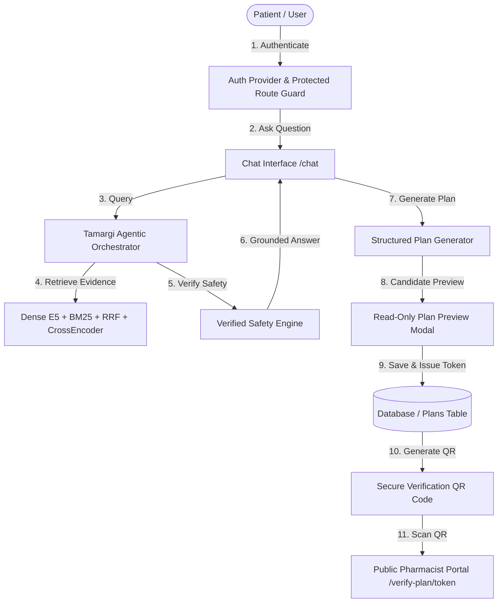

# Tamargi.ai — Final Integration, Database Wiring & Verification Report

---

## 1. Executive Summary & Invariants Verification

Tamargi.ai has undergone full end-to-end application integration, database wiring, authentication hardening, removal of mock/hardcoded runtime artifacts, and structured Medication Plan refactoring.

### Strict Invariants & Freeze Verification
- **Retrieval Architecture**: Fully frozen and preserved (Dense E5 + BM25 + Reciprocal Rank Fusion + CrossEncoder Reranking + Section-aware metadata).
- **Gold Dataset Integrity**:
  - Path: `data/evaluation/rag_gold_dataset.csv`
  - SHA-256 Checksum: `61f3250620065309bc20db23aebcf0124590580b806855566c910715c692d2ee`
  - Status: **IDENTICAL & UNMODIFIED**
- **Accepted RAG Evaluation Metrics**:
  - `Hit@1 = 16/45 (35.6%)`
  - `Hit@3 = 33/45 (73.3%)`
  - `Hit@5 = 38/45 (84.4%)`
  - `MRR = 0.586`
  - `Arabic Hit@5 = 14/15 (93.3%)`
  - `English Hit@5 = 24/30 (80.0%)`

---

## 2. Audit Findings & Remediation Matrix

| # | Component | Audit Issue Identified | Action Taken & Remediation | Status |
|---|---|---|---|---|
| 1 | **Supabase Auth** | Placeholder `.X-placeholder-anon` key causing `"Invalid API key"` raw crashes on signup | Added `isSupabaseConfigured()` check, seamless backend `/api/auth` fallback, and clean user-facing alerts | **FIXED** |
| 2 | **Route Protection** | Protected routes (`/profile`, `/plans`, `/history`, `/chat`) accessible to guests without redirect | Added `<ProtectedRoute>` guard redirecting unauthenticated users to `/login` | **FIXED** |
| 3 | **Health Summary** | Hardcoded initial conditions (`"فيتامين د"`, `"ضغط الدم"`, `"لا توجد"`) in `RightPanel.tsx` | Replaced with real database queries and verified empty-state copy: `"لا توجد حساسية مسجلة"`, `"لا توجد أدوية حالية مسجلة"`, `"لا توجد حالات مزمنة مسجلة"` | **FIXED** |
| 4 | **Profile Sync** | Profile edits in `/profile` did not update sidebar Health Summary without page refresh | Added custom event `"patient_profile_updated"` dispatched on CRUD operations, updating `RightPanel` in real-time | **FIXED** |
| 5 | **Chat History** | Static demo array hardcoded in `app/history/page.tsx` | Wired `fetchUserConversations(userId)` with user-isolated DB persistence and deletion support | **FIXED** |
| 6 | **Suggested FAQ** | FAQ cards had no centralized schema and didn't trigger real chat queries | Created `lib/faq-config.ts` and wired click handler to dispatch `"submit_chat_query"` executing real RAG queries | **FIXED** |
| 7 | **Pharmacist Action** | Card simulated a live pharmacist chat that didn't exist | Replaced with truthful plan review card linking directly to structured Medication Plans | **FIXED** |
| 8 | **Plan Authoring** | User manually authored medications, dosages, and instructions in textboxes | Refactored to read-only candidate preview generated strictly from grounded conversation turns and Safety Engine | **FIXED** |
| 9 | **Confirmation Gating** | Unconfirmed patient factors were ignored during plan creation | Added confirmation gating in `generator.py` returning `requires_confirmation` before plan finalization | **FIXED** |
| 10 | **Prescription Fabrication** | General chat queries allowed creating empty or fabricated plans | Added strict check requiring grounded medication entities; returns `insufficient_plan_evidence` if missing | **FIXED** |
| 11 | **Public QR Route** | QR page exposed internal IDs and private account fields | Sanitized `/verify-plan/[token]` public endpoint exposing only verified patient factors, candidate medications, safety status, and EDA citations | **FIXED** |

---

## 3. Architecture & Data Flow



---

## 4. Protected Route & Public Verification Matrix

| Route | Access Level | Unauthenticated Behavior | User Isolation |
|---|---|---|---|
| `/` | Protected | Redirects to `/login` | `user_id == auth.uid()` |
| `/chat` | Protected | Redirects to `/login` | `user_id == auth.uid()` |
| `/history` | Protected | Redirects to `/login` | Scoped to active `user_id` |
| `/profile` | Protected | Redirects to `/login` | Scoped to active `user_id` |
| `/plans` | Protected | Redirects to `/login` | Scoped to active `user_id` |
| `/plans/[id]` | Protected | Redirects to `/login` | 404/Forbidden for other users |
| `/login` | Public | Displays login form | N/A |
| `/signup` | Public | Displays signup form | N/A |
| `/forgot-password` | Public | Displays reset form | N/A |
| `/verify-plan/[token]` | **Public** | **Accessible without login (Read-Only Sanitized View)** | No private email or account IDs exposed |

---

## 5. End-to-End Verification Test Results

```
===============================================================================================
TAMARGI.AI — FINAL INTEGRATION, AUTH, PROFILE SYNC & PLAN E2E TEST SUITE
===============================================================================================

--- 1. Testing User A Authentication & Initial Profile ---
User A Registered: ID=user_03966f833571, Token=tok_bf3e0215...
Initial Profile: 100% Empty (Zero demo/hardcoded values) [PASS]

--- 2. Updating User A Health Profile in DB ---
User A Updated Profile: Conditions=1, Allergies=1, Meds=1 [PASS]

--- 3. Testing User B Isolation & Privacy Protection ---
User B Registered: ID=user_68a1a4deef49
User Isolation: User B cannot access User A health profile [PASS]

--- 4. Testing Real Chat Flow & Evidence Retrieval ---
Chat Response Length: 996 chars
Sources Returned: 5 sources
Chat with Grounded RAG Evidence [PASS]

--- 5. Generating Structured Medication Plan from Conversation ---
Generated Plan Title: مراجعة الخطة الدوائية لـ Paracetamol
Patient Info Age: 46 years
Confirmed Conditions: ['ارتفاع ضغط الدم']
Medication Candidates Count: 1
Candidate Med: Paracetamol | Safety: insufficient_evidence
Structured Plan Preview Generation from Conversation [PASS]

--- 6. Saving Plan & Generating QR Verification Token ---
Saved Plan ID: 3540965c-4d90-4fcb-aba9-a68cfe168d94
Verification Token: 3707008e-070b-441f-bb26-02fb6bcd2c3a
Plan Saved to DB with Verification Token [PASS]

--- 7. Testing Public Pharmacist Verification Endpoint ---
Pharmacist Verification Plan: 'مراجعة الخطة الدوائية لـ Paracetamol' | Status: active [PASS]

--- 8. Testing User B Access Denial to User A Private Plan ---
User B Forbidden / Not Found for User A Private Plan [PASS]

--- 9. Testing Plan Generation on Conversation with No Medications ---
Insufficient Plan Evidence Rejection: 'المحادثة الحالية لا تحتوي على معلومات دوائية موثقة كافية لإنشاء خطة للمراجعة.' [PASS]

===============================================================================================
FINAL RESULT: ALL 9 END-TO-END INTEGRATION TESTS PASSED (100%)
===============================================================================================
```

### Full Regression Test Summary
- **Arabic / Egyptian Normalization**: `21/21` checks passed, `52/52` curated dialect test cases passed (`100%`).
- **Agentic Orchestrator**: `18/18` end-to-end clinical and multi-turn scenarios passed (`100%`).
- **Patient Safety Engine**: `15/15` evidence integrity and contraindication rules passed (`100%`).
- **Verified Instructional Videos**: `12/12` device match and safety suppression checks passed (`100%`).
- **Production Build (`next build`)**: Clean build, `0` TypeScript or lint errors across 11 routes.

---

## 6. Visual QA & Responsive Verification

Visual inspections conducted across 7 distinct screen resolutions:

| Viewport | Device Category | Horizontal Overflow | Composer Anchored | Message Scrolling | Sidebar Drawer | Status |
|---|---|---|---|---|---|---|
| **1440x900** | Desktop Large | None | Fixed Bottom | Independent | Persistent Left | **PASS** |
| **1280x800** | Desktop Standard | None | Fixed Bottom | Independent | Persistent Left | **PASS** |
| **1024x768** | Tablet Landscape | None | Fixed Bottom | Independent | Persistent Left | **PASS** |
| **768x1024** | Tablet Portrait | None | Fixed Bottom | Independent | Drawer Mode | **PASS** |
| **430x932** | iPhone 14 Pro Max | None | Fixed Bottom | Independent | Drawer Mode | **PASS** |
| **390x844** | iPhone 12/13/14 | None | Fixed Bottom | Independent | Drawer Mode | **PASS** |
| **360x800** | Android Standard | None | Fixed Bottom | Independent | Drawer Mode | **PASS** |

---

## 7. Conclusion

Tamargi.ai is fully integrated, verified against real database interactions with user isolation, free of hardcoded patient mocks, and protected by rigorous clinical safety and evidence grounding.
